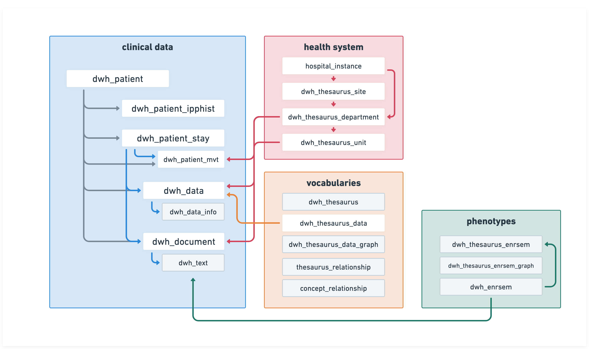

# codoc data model

This site documents the structure of our open-source data model. 
It is intended to provide a clear overview of the tables, their relationships, and how they can be used in data warehouse projects. 
For more information about our broader projects and initiatives, please visit the <a href="https://www.codoc.co/fr" target="_blank">codoc</a> website.

**Work in progress**: This documentation is just getting started — some tables are not documented yet.

<small>
**Acknowledgment**  
This work is strongly inspired by the Dr. Warehouse data model published by Garcelon, Nicolas et al. “A clinician friendly data warehouse oriented toward narrative reports: Dr. Warehouse.” Journal of biomedical informatics vol. 80 (2018): 52-63. doi:10.1016/j.jbi.2018.02.019
</small>